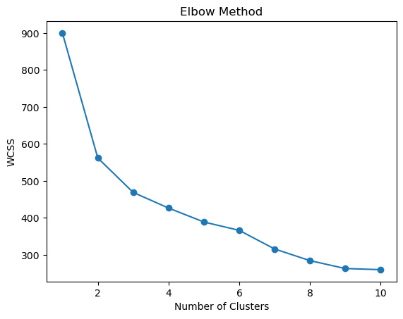
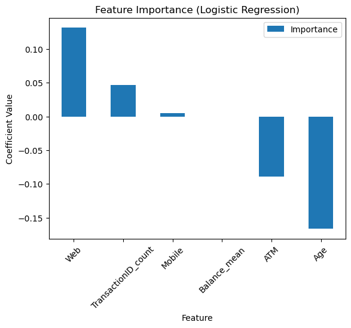
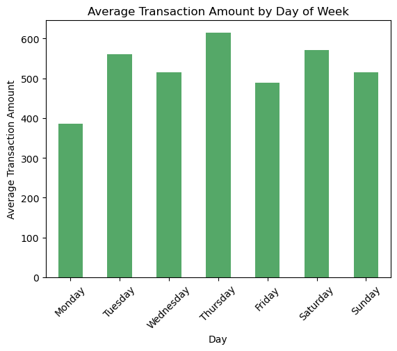

# Financial Behavior Intelligence System

[](https://colab.research.google.com/github/nikkibhoot-29/Financial-Behavior-Intelligence-System/blob/main/notebooks/Financial_Behavior_Intelligence_System.ipynb)

End-to-end analysis of financial transaction data for customer segmentation, anomaly detection, and risk-oriented modeling.

---

## Overview

Financial transaction data reflects underlying behavioral patterns — spending habits, engagement levels, and potential risk signals.

This project builds a structured pipeline to:

- segment customers based on transaction behavior
- identify anomalous activity
- predict high-value customers

The focus is not only on model performance, but on interpreting behavioral signals embedded in the data.

---

## Problem

Financial systems generate large-scale transactional data, but often lack clear methods to:

- understand customer behavior at scale
- identify high-value segments
- detect unusual or risky activity

---

## Data

Multiple relational datasets (sourced from Kaggle) were integrated:

- **FactTransaction** — transaction-level records
- **DimAccount** — account information
- **DimCustomer** — customer demographics

These were merged and transformed into a unified customer-level dataset.

---

## Methodology

### Data Preparation

- Data cleaning and validation
- Handling missing values
- Feature engineering at customer level
- Time-based feature extraction

### Exploratory Analysis

- Channel-wise transaction behavior
- Account type usage patterns
- Temporal trends (year, month, day)
- Customer activity distribution

---

## Modeling

### Customer Segmentation

**Algorithm:** KMeans

- Identified distinct behavioral groups:

  - High-value
  - Regular
  - Low-activity

---

### Anomaly Detection

**Algorithm:** Isolation Forest

- ~5% of customers flagged with unusual transaction patterns

---

### Predictive Modeling

**Multiclass Classification**

- Target: Customer segments
- Model: XGBoost
- Accuracy: ~55%
  → Indicates overlap between behavioral groups (realistic scenario)

**Binary Classification**

- Target: High-value vs others
- Models: Logistic Regression, XGBoost
- Accuracy: ~95%
  → Clear separation of high-value customers

---

## Interpretation

Feature importance analysis highlights key drivers:

- Transaction frequency
- Digital channel usage (Web, Mobile)
- ATM usage patterns
- Age

---

## Key Insights

- High-value customers show higher digital engagement
- Lower reliance on ATM transactions among high-value users
- Younger customers exhibit higher activity levels
- Transaction patterns vary seasonally
- Suspended accounts display irregular high-value activity → potential risk indicator

---

## Visual Insights

### Customer Segmentation



### Feature Importance



### Transaction Trends



---

## Execution  

The pipeline is implemented in both:  
- Jupyter Notebook (analysis & experimentation)  
- `main.py` (reproducible execution)  

Install dependencies:
```bash
pip install -r requirements.txt
```

Run:

```bash
python main.py
```

---

## Applications

- Customer segmentation for targeted strategies
- Risk monitoring and anomaly detection
- Behavioral analysis for decision-making
- Identification of high-value customers

---

## Tech Stack

Python · Pandas · NumPy · Scikit-learn · XGBoost · Matplotlib

---

## Closing Note

Behavioral patterns in financial data are rarely explicit.  
The value lies in structuring, modeling, and interpreting them with precision.
